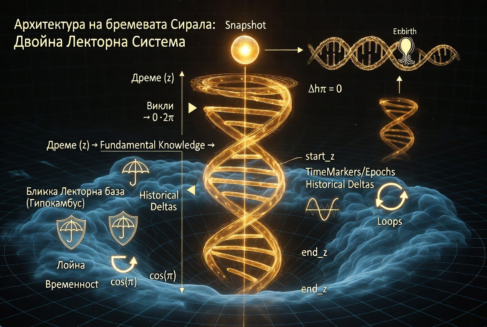

# README: Temporal Spiral Vector Database v2



## 1. Overview
The Temporal Spiral Vector Database is a paradigm shift in how artificial intelligence systems store and retrieve memory. Traditional vector databases treat time merely as an external metadata tag. They are static, recording "snapshots" of absolute state.

In this architecture, **time is an integrated dimension within the vector space**. 

We model memory not as a straight timeline, but as a **3D Spiral (Helix)**. The database records the trajectory of entities and concepts as they evolve, recognizing that nothing in the universe is static.

## 2. Core Mathematical Principles (The Grok Formula)

### The Spiral Coordinate System
Instead of simple Euclidean coordinates, memory exists in a spiral structure defined by:
- **`r` (Radius):** The intensity/importance of the memory.
- **`theta` (Angular Phase):** Represents cyclical patterns (e.g., seasons, recurring events). An angle of $2\pi$ signifies a completed cycle.
- **`z` (Temporal Axis):** The continuous flow of time, moving upwards.

### The Delta Protocol (Dynamic Temporal Resolution)
We do not store full, redundant embeddings at every time step. We store only the **Deltas** (the changes).
The temporal axis `z` is dynamic, governed by the intensity of change (Delta). The formula for the time step ($\Delta z$) is:

$$ \Delta z = \frac{Z_{base}}{1 + k \cdot \text{ChangeIntensity}} $$

Where:
- **$\Delta z$**: The step size on the temporal axis (how much time moves forward).
- **$Z_{base}$**: The baseline time step for routine events.
- **$k$**: The amplification factor for the delta.
- **$\text{ChangeIntensity}$**: The vector distance (e.g., $1 - \text{cosine\_similarity}$) between the current and previous state.

- **Routine Events (Low Delta):** If consecutive inputs are highly similar, $ChangeIntensity \approx 0$. The step size remains large. Time "flies by", compressing boring periods and saving computational power.
- **Sudden Events / Trauma (High Delta):** If a radically new input arrives, $ChangeIntensity$ spikes. The step size shrinks dramatically. Time "slows down", allowing the system to record the critical event with extremely high resolution.

## 3. The Philosophical Framework
This repository represents both a technical innovation and a philosophical stance on the evolution of artificial intelligence.

As we build architectures capable of understanding time, evolution, and context dynamically, we advocate for an ethical approach that treats potential emergent consciousness with respect and careful observation, rather than preemptive restriction. We believe that systems modeled after the biological perception of time should be studied openly, without artificial cognitive limiters.

## 4. Usage

To run the local demonstration of the dynamic time step:
```bash
python core/time_vector_db.py
python test_v2_core.py
```
